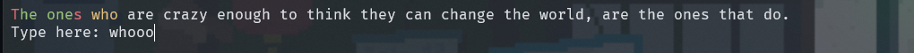

# Duy_e's cpp typing practice 0.1

## Description
This is a simple typing practice program written in C++.

## Features
- No features yet :3

## How to use

1. Clone this repository
2. Compile the program and run it
```bash
cd ./src
g++ ./*.cpp -o ./main
./main
```

## UI

This is the UI of the program. The current words will be highlighted in red. There is a text box at the bottome for you to type in.

It has minimal feature, with a ramdom quote generator and highlight the characters you type wrong in red, and right in green.

Remember to press 'space', not 'enter' after you finish typing a word. : D because I'm too lazy to implement the enter key.

### Example
```
The ones who are crazy enough to think they can change the world, are the ones that do.
Type here:
```
### Example of wrong typing


## Last words

This is a simple project I made to practice my C++ skills. I'm still learning, so any feedback is appreciated. Thank you for reading this readme.

Have a nice day!
